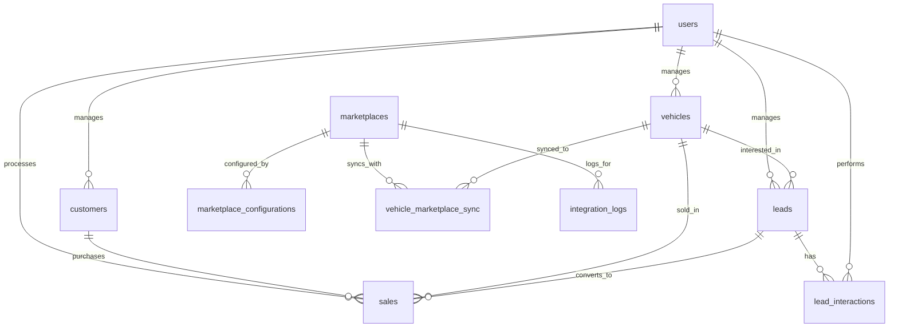

# ApiCrmAlive
# Documentação Completa da API - CRM Automotivo

## Índice
1. [Modelos de Dados](#modelos-de-dados)
2. [Relacionamentos](#relacionamentos)
3. [Endpoints da API](#endpoints-da-api)
4. [Schemas de Request/Response](#schemas-de-requestresponse)
5. [Códigos de Status](#códigos-de-status)
6. [Autenticação](#autenticação)

---

## Modelos de Dados

### Campos Comuns (Todas as Tabelas)
Todas as tabelas devem incluir os seguintes campos:
```sql
created_at TIMESTAMPTZ DEFAULT NOW() NOT NULL,
updated_at TIMESTAMPTZ DEFAULT NOW() NOT NULL,
updated_by UUID REFERENCES auth.users(id) NOT NULL
```

### 1. Usuários (users)
```sql
CREATE TABLE users (
  id UUID PRIMARY KEY DEFAULT gen_random_uuid(),
  name VARCHAR(255) NOT NULL,
  email VARCHAR(255) UNIQUE NOT NULL,
  password_hash VARCHAR(255) NOT NULL,
  role VARCHAR(50) NOT NULL DEFAULT 'vendedor', -- 'admin', 'gerente', 'vendedor'
  phone VARCHAR(20),
  is_active BOOLEAN DEFAULT true,
  receive_notifications BOOLEAN DEFAULT true,
  created_at TIMESTAMPTZ DEFAULT NOW() NOT NULL,
  updated_at TIMESTAMPTZ DEFAULT NOW() NOT NULL,
  updated_by UUID REFERENCES auth.users(id) NOT NULL
);
```

### 2. Clientes (customers)
```sql
CREATE TABLE customers (
  id UUID PRIMARY KEY DEFAULT gen_random_uuid(),
  name VARCHAR(255) NOT NULL,
  cpf VARCHAR(14) UNIQUE NOT NULL,
  phone VARCHAR(20) NOT NULL,
  email VARCHAR(255),
  address JSONB, -- {street, number, neighborhood, city, state, zip_code}
  birth_date DATE,
  occupation VARCHAR(255),
  monthly_income DECIMAL(12,2),
  last_purchase_date DATE,
  total_purchases INTEGER DEFAULT 0,
  total_spent DECIMAL(12,2) DEFAULT 0,
  customer_type VARCHAR(50) DEFAULT 'pessoa_fisica', -- 'pessoa_fisica', 'pessoa_juridica'
  created_at TIMESTAMPTZ DEFAULT NOW() NOT NULL,
  updated_at TIMESTAMPTZ DEFAULT NOW() NOT NULL,
  updated_by UUID REFERENCES auth.users(id) NOT NULL
);
```

### 3. Veículos (vehicles)
```sql
CREATE TABLE vehicles (
  id UUID PRIMARY KEY DEFAULT gen_random_uuid(),
  make VARCHAR(100) NOT NULL,
  model VARCHAR(100) NOT NULL,
  year INTEGER NOT NULL,
  plate VARCHAR(10) UNIQUE NOT NULL,
  color VARCHAR(50) NOT NULL,
  fuel VARCHAR(50) NOT NULL, -- 'gasolina', 'etanol', 'flex', 'diesel', 'eletrico', 'hibrido'
  transmission VARCHAR(50) NOT NULL, -- 'manual', 'automatico', 'cvt'
  mileage INTEGER NOT NULL,
  price DECIMAL(12,2) NOT NULL,
  cost_price DECIMAL(12,2),
  status VARCHAR(50) DEFAULT 'disponivel', -- 'disponivel', 'reservado', 'vendido', 'manutencao'
  entry_date DATE NOT NULL,
  description TEXT,
  features JSONB, -- array de características
  images JSONB, -- array de URLs das imagens
  documents JSONB, -- {registration, inspection, etc}
  previous_owner_id UUID REFERENCES customers(id),
  created_at TIMESTAMPTZ DEFAULT NOW() NOT NULL,
  updated_at TIMESTAMPTZ DEFAULT NOW() NOT NULL,
  updated_by UUID REFERENCES auth.users(id) NOT NULL
);
```

### 4. Leads (leads)
```sql
CREATE TABLE leads (
  id UUID PRIMARY KEY DEFAULT gen_random_uuid(),
  name VARCHAR(255) NOT NULL,
  phone VARCHAR(20) NOT NULL,
  email VARCHAR(255),
  source VARCHAR(100) NOT NULL, -- 'website', 'whatsapp', 'presencial', 'indicacao', 'facebook', 'google'
  status VARCHAR(50) DEFAULT 'novo', -- 'novo', 'em_negociacao', 'em_agendamentos', 'convertido', 'perdido'
  vehicle_interest_id UUID REFERENCES vehicles(id),
  vehicle_interest_description TEXT,
  budget_min DECIMAL(12,2),
  budget_max DECIMAL(12,2),
  financing_needed BOOLEAN DEFAULT false,
  last_contact_date DATE,
  next_followup_date DATE,
  seller_id UUID REFERENCES users(id),
  has_manager_alert BOOLEAN DEFAULT false,
  notes TEXT,
  conversion_probability INTEGER CHECK (conversion_probability >= 0 AND conversion_probability <= 100),
  created_at TIMESTAMPTZ DEFAULT NOW() NOT NULL,
  updated_at TIMESTAMPTZ DEFAULT NOW() NOT NULL,
  updated_by UUID REFERENCES auth.users(id) NOT NULL
);
```

### 5. Vendas (sales)
```sql
CREATE TABLE sales (
  id UUID PRIMARY KEY DEFAULT gen_random_uuid(),
  customer_id UUID REFERENCES customers(id) NOT NULL,
  vehicle_id UUID REFERENCES vehicles(id) NOT NULL,
  seller_id UUID REFERENCES users(id) NOT NULL,
  lead_id UUID REFERENCES leads(id), -- origem da venda se veio de um lead
  sale_date DATE NOT NULL,
  sale_price DECIMAL(12,2) NOT NULL,
  down_payment DECIMAL(12,2) DEFAULT 0,
  financing_amount DECIMAL(12,2) DEFAULT 0,
  installments INTEGER DEFAULT 0,
  payment_method VARCHAR(50) NOT NULL, -- 'vista', 'financiamento', 'consorcio', 'troca'
  status VARCHAR(50) DEFAULT 'pendente', -- 'pendente', 'aprovado', 'concluido', 'cancelado'
  commission_rate DECIMAL(5,2) DEFAULT 0,
  commission_amount DECIMAL(12,2) DEFAULT 0,
  notes TEXT,
  contract_url VARCHAR(500),
  created_at TIMESTAMPTZ DEFAULT NOW() NOT NULL,
  updated_at TIMESTAMPTZ DEFAULT NOW() NOT NULL,
  updated_by UUID REFERENCES auth.users(id) NOT NULL
);
```

### 6. Marketplaces (marketplaces)
```sql
CREATE TABLE marketplaces (
  id UUID PRIMARY KEY DEFAULT gen_random_uuid(),
  name VARCHAR(100) NOT NULL,
  slug VARCHAR(50) UNIQUE NOT NULL,
  api_endpoint VARCHAR(500),
  is_active BOOLEAN DEFAULT false,
  logo_url VARCHAR(500),
  description TEXT,
  created_at TIMESTAMPTZ DEFAULT NOW() NOT NULL,
  updated_at TIMESTAMPTZ DEFAULT NOW() NOT NULL,
  updated_by UUID REFERENCES auth.users(id) NOT NULL
);
```

### 7. Configurações de Marketplace (marketplace_configurations)
```sql
CREATE TABLE marketplace_configurations (
  id UUID PRIMARY KEY DEFAULT gen_random_uuid(),
  marketplace_id UUID REFERENCES marketplaces(id) NOT NULL,
  api_key VARCHAR(500),
  account_id VARCHAR(255),
  store_id VARCHAR(255),
  connection_status VARCHAR(50) DEFAULT 'desconectado', -- 'conectado', 'desconectado', 'erro'
  last_test_date TIMESTAMPTZ,
  last_sync_date TIMESTAMPTZ,
  auto_sync_enabled BOOLEAN DEFAULT true,
  configuration_data JSONB, -- configurações específicas do marketplace
  created_at TIMESTAMPTZ DEFAULT NOW() NOT NULL,
  updated_at TIMESTAMPTZ DEFAULT NOW() NOT NULL,
  updated_by UUID REFERENCES auth.users(id) NOT NULL
);
```

### 8. Sincronização de Veículos (vehicle_marketplace_sync)
```sql
CREATE TABLE vehicle_marketplace_sync (
  id UUID PRIMARY KEY DEFAULT gen_random_uuid(),
  vehicle_id UUID REFERENCES vehicles(id) NOT NULL,
  marketplace_id UUID REFERENCES marketplaces(id) NOT NULL,
  external_id VARCHAR(255), -- ID do anúncio no marketplace
  sync_status VARCHAR(50) DEFAULT 'pendente', -- 'pendente', 'enviado', 'ativo', 'erro', 'removido'
  last_sync_date TIMESTAMPTZ,
  error_message TEXT,
  sync_data JSONB, -- dados específicos do envio
  created_at TIMESTAMPTZ DEFAULT NOW() NOT NULL,
  updated_at TIMESTAMPTZ DEFAULT NOW() NOT NULL,
  updated_by UUID REFERENCES auth.users(id) NOT NULL,
  UNIQUE(vehicle_id, marketplace_id)
);
```

### 9. Interações com Leads (lead_interactions)
```sql
CREATE TABLE lead_interactions (
  id UUID PRIMARY KEY DEFAULT gen_random_uuid(),
  lead_id UUID REFERENCES leads(id) NOT NULL,
  user_id UUID REFERENCES users(id) NOT NULL,
  interaction_type VARCHAR(50) NOT NULL, -- 'ligacao', 'whatsapp', 'email', 'presencial', 'proposta'
  interaction_date TIMESTAMPTZ DEFAULT NOW() NOT NULL,
  duration_minutes INTEGER,
  notes TEXT,
  next_action VARCHAR(255),
  created_at TIMESTAMPTZ DEFAULT NOW() NOT NULL,
  updated_at TIMESTAMPTZ DEFAULT NOW() NOT NULL,
  updated_by UUID REFERENCES auth.users(id) NOT NULL
);
```

### 10. Logs de Integração (integration_logs)
```sql
CREATE TABLE integration_logs (
  id UUID PRIMARY KEY DEFAULT gen_random_uuid(),
  marketplace_id UUID REFERENCES marketplaces(id) NOT NULL,
  vehicle_id UUID REFERENCES vehicles(id),
  action VARCHAR(100) NOT NULL, -- 'create', 'update', 'delete', 'test_connection'
  status VARCHAR(50) NOT NULL, -- 'sucesso', 'erro', 'pendente'
  request_data JSONB,
  response_data JSONB,
  error_message TEXT,
  execution_time_ms INTEGER,
  created_at TIMESTAMPTZ DEFAULT NOW() NOT NULL,
  updated_at TIMESTAMPTZ DEFAULT NOW() NOT NULL,
  updated_by UUID REFERENCES auth.users(id) NOT NULL
);
```

---

## Relacionamentos



---

## Endpoints da API

### Autenticação
```
POST /auth/login
POST /auth/logout
POST /auth/refresh
GET  /auth/me
```

### Usuários
```
GET    /api/users
GET    /api/users/:id
POST   /api/users
PUT    /api/users/:id
DELETE /api/users/:id
PATCH  /api/users/:id/status
```

### Clientes
```
GET    /api/customers
GET    /api/customers/:id
POST   /api/customers
PUT    /api/customers/:id
DELETE /api/customers/:id
GET    /api/customers/:id/purchase-history
GET    /api/customers/search?q=term
```

### Veículos
```
GET    /api/vehicles
GET    /api/vehicles/:id
POST   /api/vehicles
PUT    /api/vehicles/:id
DELETE /api/vehicles/:id
PATCH  /api/vehicles/:id/status
GET    /api/vehicles/available
GET    /api/vehicles/search?filters
POST   /api/vehicles/:id/images
DELETE /api/vehicles/:id/images/:imageId
```

### Leads
```
GET    /api/leads
GET    /api/leads/:id
POST   /api/leads
PUT    /api/leads/:id
DELETE /api/leads/:id
PATCH  /api/leads/:id/status
GET    /api/leads/kanban
POST   /api/leads/:id/interactions
GET    /api/leads/:id/interactions
POST   /api/leads/:id/convert
```

### Vendas
```
GET    /api/sales
GET    /api/sales/:id
POST   /api/sales
PUT    /api/sales/:id
DELETE /api/sales/:id
GET    /api/sales/reports
GET    /api/sales/dashboard-stats
```

### Marketplaces
```
GET    /api/marketplaces
GET    /api/marketplaces/:id
POST   /api/marketplaces
PUT    /api/marketplaces/:id
DELETE /api/marketplaces/:id
GET    /api/marketplaces/:id/configuration
POST   /api/marketplaces/:id/configuration
PUT    /api/marketplaces/:id/configuration
POST   /api/marketplaces/:id/test-connection
POST   /api/marketplaces/:id/sync-vehicle/:vehicleId
POST   /api/marketplaces/sync-all-vehicles
GET    /api/marketplaces/:id/sync-status
GET    /api/marketplaces/:id/logs
```

---

## Schemas de Request/Response

### Usuários

#### POST /api/users
**Request:**
```json
{
  "name": "João Silva",
  "email": "joao@email.com",
  "password": "senha123",
  "role": "vendedor",
  "phone": "(11) 99999-9999",
  "is_active": true,
  "receive_notifications": true
}
```

**Response:**
```json
{
  "id": "uuid",
  "name": "João Silva",
  "email": "joao@email.com",
  "role": "vendedor",
  "phone": "(11) 99999-9999",
  "is_active": true,
  "receive_notifications": true,
  "created_at": "2024-01-15T10:30:00Z",
  "updated_at": "2024-01-15T10:30:00Z",
  "updated_by": "uuid"
}
```

#### GET /api/users
**Response:**
```json
{
  "data": [
    {
      "id": "uuid",
      "name": "João Silva",
      "email": "joao@email.com",
      "role": "vendedor",
      "phone": "(11) 99999-9999",
      "is_active": true,
      "receive_notifications": true,
      "created_at": "2024-01-15T10:30:00Z",
      "updated_at": "2024-01-15T10:30:00Z"
    }
  ],
  "pagination": {
    "page": 1,
    "limit": 10,
    "total": 50,
    "pages": 5
  }
}
```

### Clientes

#### POST /api/customers
**Request:**
```json
{
  "name": "Maria Santos",
  "cpf": "123.456.789-00",
  "phone": "(11) 98888-7777",
  "email": "maria@email.com",
  "address": {
    "street": "Rua das Flores",
    "number": "123",
    "neighborhood": "Centro",
    "city": "São Paulo",
    "state": "SP",
    "zip_code": "01234-567"
  },
  "birth_date": "1985-06-15",
  "occupation": "Engenheira",
  "monthly_income": 8000.00,
  "customer_type": "pessoa_fisica"
}
```

**Response:**
```json
{
  "id": "uuid",
  "name": "Maria Santos",
  "cpf": "123.456.789-00",
  "phone": "(11) 98888-7777",
  "email": "maria@email.com",
  "address": {
    "street": "Rua das Flores",
    "number": "123",
    "neighborhood": "Centro",
    "city": "São Paulo",
    "state": "SP",
    "zip_code": "01234-567"
  },
  "birth_date": "1985-06-15",
  "occupation": "Engenheira",
  "monthly_income": 8000.00,
  "customer_type": "pessoa_fisica",
  "total_purchases": 0,
  "total_spent": 0.00,
  "created_at": "2024-01-15T10:30:00Z",
  "updated_at": "2024-01-15T10:30:00Z",
  "updated_by": "uuid"
}
```

### Veículos

#### POST /api/vehicles
**Request:**
```json
{
  "make": "Toyota",
  "model": "Corolla",
  "year": 2020,
  "plate": "ABC-1234",
  "color": "Branco",
  "fuel": "flex",
  "transmission": "automatico",
  "mileage": 15000,
  "price": 85000.00,
  "cost_price": 75000.00,
  "status": "disponivel",
  "entry_date": "2024-01-10",
  "description": "Veículo em excelente estado",
  "features": [
    "ar_condicionado",
    "vidros_eletricos",
    "direcao_hidraulica",
    "airbag",
    "abs"
  ],
  "images": [
    "https://example.com/image1.jpg",
    "https://example.com/image2.jpg"
  ]
}
```

**Response:**
```json
{
  "id": "uuid",
  "make": "Toyota",
  "model": "Corolla",
  "year": 2020,
  "plate": "ABC-1234",
  "color": "Branco",
  "fuel": "flex",
  "transmission": "automatico",
  "mileage": 15000,
  "price": 85000.00,
  "cost_price": 75000.00,
  "status": "disponivel",
  "entry_date": "2024-01-10",
  "description": "Veículo em excelente estado",
  "features": [
    "ar_condicionado",
    "vidros_eletricos",
    "direcao_hidraulica",
    "airbag",
    "abs"
  ],
  "images": [
    "https://example.com/image1.jpg",
    "https://example.com/image2.jpg"
  ],
  "created_at": "2024-01-15T10:30:00Z",
  "updated_at": "2024-01-15T10:30:00Z",
  "updated_by": "uuid"
}
```

### Leads

#### POST /api/leads
**Request:**
```json
{
  "name": "Pedro Costa",
  "phone": "(11) 97777-6666",
  "email": "pedro@email.com",
  "source": "website",
  "status": "novo",
  "vehicle_interest_id": "uuid",
  "vehicle_interest_description": "Sedan compacto até R$ 90.000",
  "budget_min": 70000.00,
  "budget_max": 90000.00,
  "financing_needed": true,
  "seller_id": "uuid",
  "notes": "Cliente interessado em test drive"
}
```

**Response:**
```json
{
  "id": "uuid",
  "name": "Pedro Costa",
  "phone": "(11) 97777-6666",
  "email": "pedro@email.com",
  "source": "website",
  "status": "novo",
  "vehicle_interest_id": "uuid",
  "vehicle_interest_description": "Sedan compacto até R$ 90.000",
  "budget_min": 70000.00,
  "budget_max": 90000.00,
  "financing_needed": true,
  "seller_id": "uuid",
  "notes": "Cliente interessado em test drive",
  "conversion_probability": null,
  "has_manager_alert": false,
  "created_at": "2024-01-15T10:30:00Z",
  "updated_at": "2024-01-15T10:30:00Z",
  "updated_by": "uuid"
}
```

### Vendas

#### POST /api/sales
**Request:**
```json
{
  "customer_id": "uuid",
  "vehicle_id": "uuid",
  "seller_id": "uuid",
  "lead_id": "uuid",
  "sale_date": "2024-01-15",
  "sale_price": 85000.00,
  "down_payment": 20000.00,
  "financing_amount": 65000.00,
  "installments": 48,
  "payment_method": "financiamento",
  "status": "pendente",
  "commission_rate": 2.5,
  "notes": "Financiamento aprovado pelo banco"
}
```

**Response:**
```json
{
  "id": "uuid",
  "customer_id": "uuid",
  "vehicle_id": "uuid",
  "seller_id": "uuid",
  "lead_id": "uuid",
  "sale_date": "2024-01-15",
  "sale_price": 85000.00,
  "down_payment": 20000.00,
  "financing_amount": 65000.00,
  "installments": 48,
  "payment_method": "financiamento",
  "status": "pendente",
  "commission_rate": 2.5,
  "commission_amount": 2125.00,
  "notes": "Financiamento aprovado pelo banco",
  "created_at": "2024-01-15T10:30:00Z",
  "updated_at": "2024-01-15T10:30:00Z",
  "updated_by": "uuid"
}
```

### Configuração de Marketplace

#### POST /api/marketplaces/:id/configuration
**Request:**
```json
{
  "api_key": "api_key_secreta",
  "account_id": "12345",
  "store_id": "loja_abc",
  "auto_sync_enabled": true,
  "configuration_data": {
    "webhook_url": "https://api.exemplo.com/webhook",
    "default_category": "carros",
    "listing_duration": 30
  }
}
```

**Response:**
```json
{
  "id": "uuid",
  "marketplace_id": "uuid",
  "connection_status": "conectado",
  "auto_sync_enabled": true,
  "last_test_date": "2024-01-15T10:30:00Z",
  "created_at": "2024-01-15T10:30:00Z",
  "updated_at": "2024-01-15T10:30:00Z",
  "updated_by": "uuid"
}
```

#### POST /api/marketplaces/:id/test-connection
**Response:**
```json
{
  "status": "sucesso",
  "message": "Conexão estabelecida com sucesso",
  "details": {
    "response_time_ms": 250,
    "api_version": "v2.1",
    "account_verified": true
  }
}
```

### Sincronização de Veículo

#### POST /api/marketplaces/:id/sync-vehicle/:vehicleId
**Response:**
```json
{
  "id": "uuid",
  "vehicle_id": "uuid",
  "marketplace_id": "uuid",
  "external_id": "ML123456789",
  "sync_status": "enviado",
  "last_sync_date": "2024-01-15T10:30:00Z",
  "sync_data": {
    "listing_url": "https://marketplace.com/veiculos/ML123456789",
    "category_id": "carros_sedan",
    "status": "active"
  }
}
```

### Logs de Integração

#### GET /api/marketplaces/:id/logs
**Response:**
```json
{
  "data": [
    {
      "id": "uuid",
      "marketplace_id": "uuid",
      "vehicle_id": "uuid",
      "action": "create",
      "status": "sucesso",
      "execution_time_ms": 1250,
      "created_at": "2024-01-15T10:30:00Z"
    }
  ],
  "pagination": {
    "page": 1,
    "limit": 20,
    "total": 100,
    "pages": 5
  }
}
```

---

## Códigos de Status

### Códigos de Sucesso
- `200` - OK (GET, PUT, PATCH)
- `201` - Created (POST)
- `204` - No Content (DELETE)

### Códigos de Erro
- `400` - Bad Request (dados inválidos)
- `401` - Unauthorized (não autenticado)
- `403` - Forbidden (sem permissão)
- `404` - Not Found (recurso não encontrado)
- `409` - Conflict (conflito de dados, ex: email já existe)
- `422` - Unprocessable Entity (validação falhou)
- `500` - Internal Server Error

### Formato de Erro
```json
{
  "error": {
    "code": "VALIDATION_FAILED",
    "message": "Os dados fornecidos são inválidos",
    "details": [
      {
        "field": "email",
        "message": "Email é obrigatório"
      }
    ]
  }
}
```

---

## Autenticação

### JWT Token
Todos os endpoints (exceto login) requerem autenticação via Bearer Token:

```
Authorization: Bearer <jwt_token>
```

### Refresh Token
Para renovar o token:

**POST /auth/refresh**
```json
{
  "refresh_token": "refresh_token_aqui"
}
```

**Response:**
```json
{
  "access_token": "novo_jwt_token",
  "refresh_token": "novo_refresh_token",
  "expires_in": 3600
}
```

---

## Funcionalidades Especiais

### Triggers Automáticos
1. **Atualizar updated_at**: Trigger para atualizar automaticamente o campo `updated_at` em todas as tabelas
2. **Sincronização de Veículos**: Trigger para enviar veículo para marketplaces ativos quando criado/atualizado
3. **Conversão de Lead**: Trigger para atualizar estatísticas quando lead é convertido

### Edge Functions Sugeridas
1. **sync-vehicle-to-marketplaces**: Função para sincronizar veículo com todos os marketplaces ativos
2. **process-webhook**: Função para processar webhooks dos marketplaces
3. **send-lead-notification**: Função para enviar notificações de novos leads
4. **generate-sales-report**: Função para gerar relatórios de vendas

### Índices Sugeridos
```sql
-- Performance para consultas frequentes
CREATE INDEX idx_vehicles_status ON vehicles(status);
CREATE INDEX idx_vehicles_make_model ON vehicles(make, model);
CREATE INDEX idx_leads_status ON leads(status);
CREATE INDEX idx_leads_seller ON leads(seller_id);
CREATE INDEX idx_sales_date ON sales(sale_date);
CREATE INDEX idx_customers_cpf ON customers(cpf);
```

### Políticas RLS (Row Level Security)
```sql
-- Exemplo para leads - usuários só veem seus próprios leads ou se forem gerentes/admin
CREATE POLICY "users_can_view_own_leads" ON leads
  FOR SELECT USING (
    seller_id = auth.uid() OR 
    EXISTS (
      SELECT 1 FROM users 
      WHERE id = auth.uid() 
      AND role IN ('gerente', 'admin')
    )
  );
```

Esta documentação fornece uma base sólida para implementar todo o backend do CRM automotivo com integração completa de marketplaces.
